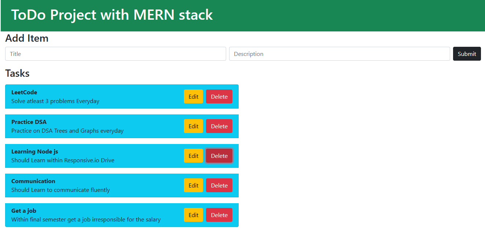

# 📝 ToDo Project with MERN Stack

A simple and responsive full-stack To-Do List web application built using the **MERN stack** (MongoDB, Express.js, React, Node.js) and styled with **Bootstrap**. The app allows users to add, edit, and delete tasks with a title and description.

---

## 🚀 Features

- ✅ Add tasks with title and description
- ✏️ Edit tasks in-place
- 🗑 Delete tasks
- 📱 Responsive Bootstrap UI
- 🔄 Realtime updates with server integration (Express + MongoDB)

---

## 🛠 Tech Stack

| Tech       | Usage                                   |
|------------|------------------------------------------|
| MongoDB    | Database to store tasks                  |
| Express.js | REST API to handle backend logic         |
| React.js   | Frontend library for interactive UI      |
| Node.js    | Backend runtime environment              |
| Bootstrap  | For responsive and styled UI components  |

---

## 📂 Project Structure

```

/to-do-mern
├── backend
│   ├── server.js
│   ├── models/
│   └── routes/
├── front-end
│   ├── src/
│   │   ├── App.js
│   │   ├── components/
│   │   └── styles/
├── README.md

````

---

## 📸 Screenshot



---

## 🔧 Installation and Setup Instructions

### 1. Clone the repo

```bash
git clone [https://github.com/your-username/to-do-mern](https://github.com/harish45264/To-Do-MERN).git
cd To-Do-MERN
````

### 2. Backend Setup

```bash
cd backend
npm install
node server.js
```

Make sure your MongoDB server is running locally or update the connection string in `server.js`.

### 3. Frontend Setup

```bash
cd front-end
npm install
npm start
```

The frontend will start on `http://localhost:3000`.

---

## 📬 API Endpoints (Express)

| Method | Endpoint         | Description        |
| ------ | ---------------- | ------------------ |
| GET    | `/api/tasks`     | Get all tasks      |
| POST   | `/api/tasks`     | Create a new task  |
| PUT    | `/api/tasks/:id` | Update an existing |
| DELETE | `/api/tasks/:id` | Delete a task      |

---

## ✅ Future Enhancements

* Task status (done/in-progress)
* User authentication
* Task deadlines and reminders
* Persistent edit mode with autosave

---

## 🤝 Contribution

Feel free to fork the repository and submit pull requests. All contributions are welcome!

---

## 🙌 Acknowledgements

* [React Docs](https://reactjs.org/)
* [Bootstrap Docs](https://getbootstrap.com/)
* [MongoDB](https://www.mongodb.com/)
* [Express.js](https://expressjs.com/)

```
